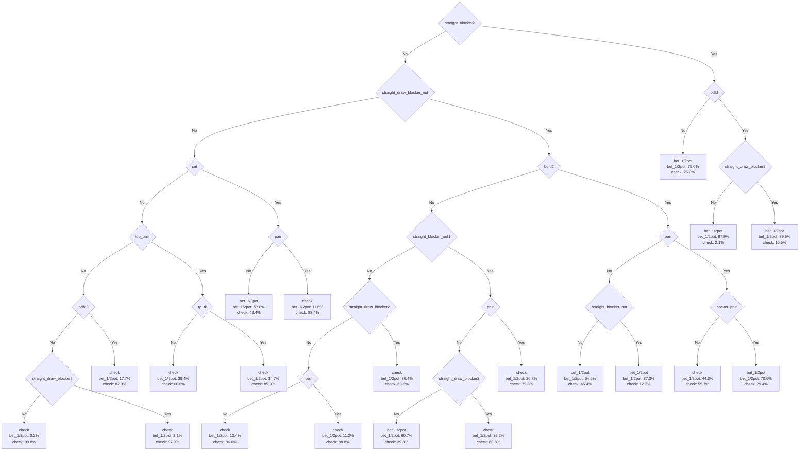
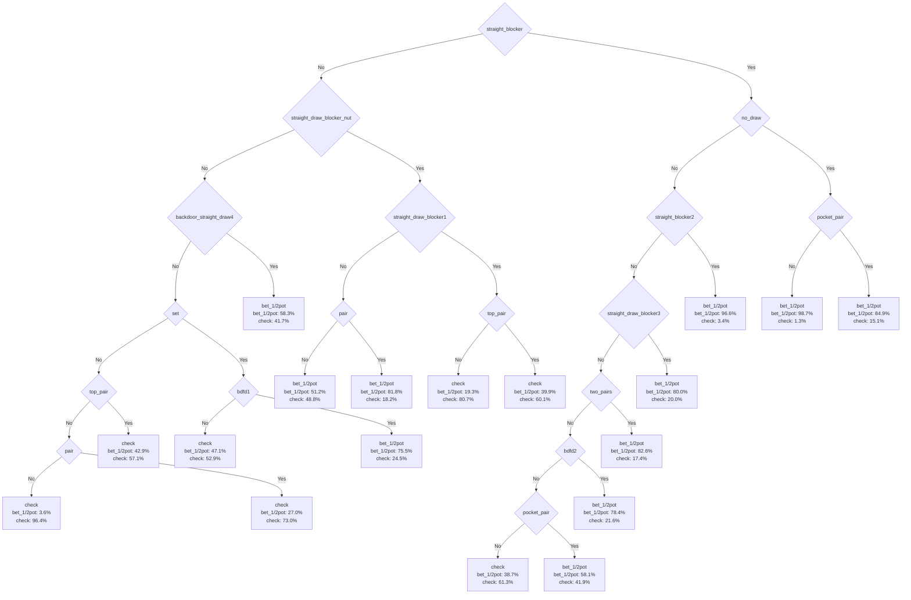

# GTO Strategy Analysis: Lead vs NoLead on 9s6d5c

**Date:** 2025-12-04
**Project:** LLM Range Tool - PLO4 GTO Analysis
**Board:** 9s6d5c (connected, two-tone)

---

## Experiment Overview

This analysis compares Hero's optimal continuation betting (c-bet) strategies in two distinct scenarios on the flop 9s6d5c in PLO4 (4-card Omaha). Both scenarios involve Hero being in position after raising preflop and facing Villain's check, but differ critically in whether Villain had the option to donk bet.

### Game Context

- **Hero:** In position, made preflop raise
- **Villain:** Out of position, checks on flop 9s6d5c
- **Hero's Decision:** Should I c-bet? How often? With what hands?

### Scenario Definitions

**Lead Scenario:**
- Villain CAN make donk bet (lead out) but CHOOSES to check
- Villain's check is VOLUNTARY → provides information about range
- Villain's range is FILTERED (removed hands that would donk)

**NoLead Scenario:**
- Villain CANNOT make donk bet (option disabled in game rules)
- Villain's check is FORCED → provides NO information
- Villain's range is UNFILTERED (contains entire range)

---

## Methodology

### 1. Data Sources

Two sets of GTO solutions from PLO4 solver for board 9s6d5c:

**Lead Range Files:**
- `1_2 POT.csv` - 66,550 combos (Hero bets 1/2 pot after Villain's voluntary check)
- `CHECK.csv` - 62,788 combos (Hero checks back after Villain's voluntary check)
- **Total:** 129,338 combos

**NoLead Range Files:**
- `NoLead_1_2 POT.csv` - 49,746 combos (Hero bets 1/2 pot after Villain's forced check)
- `NoLead_CHECK.csv` - 79,510 combos (Hero checks back after Villain's forced check)
- **Total:** 129,256 combos

### 2. Bucketing System

Each combo analyzed through **85 binary features** (buckets):

**Categories:**
- Made hands: flush, sets, trips, pairs, straights, full houses
- Draws: flush draws, straight draws, wraps, gutshots, backdoor draws
- Blockers: straight blockers, flush blockers, draw blockers (at various levels)
- Hand strength: top pair, middle pair, pocket pairs, kicker strength

**Function:** `get_all_buckets(combo, board)` returns [0,1,0,...,1] array of 85 features

### 3. Matrix Building

For each scenario:
1. Load GTO ranges from CSV files
2. Bucket each combo (85 features)
3. Group by unique feature combinations
4. Sum weights (frequencies) by action
5. Normalize to percentages
6. **Output:** Bucket matrix (1,368 unique combinations × 2 actions)

### 4. Decision Tree Training

Used scikit-learn DecisionTreeClassifier with:
- **Algorithm:** CART (Gini impurity)
- **Sample weights:** Combo frequencies from GTO solver
- **Parameter:** `min_samples_leaf` ∈ {1, 10, 50}
- **Features:** 85 bucket features (readable names)
- **Target:** Action with max percentage (bet_1/2pot vs check)

### 5. Exports Generated

For each tree (6 total: Lead/NoLead × min1/min10/min50):

**Mermaid Diagram (.mmd):**
- Flowchart format with readable bucket names
- Node decisions and leaf percentages
- Viewable on GitHub, mermaid.live, VS Code

**Metadata JSON:**
- Feature importance (sorted)
- Node structure (splits, thresholds, samples)
- Leaf statistics (decisions, percentages)
- Tree statistics (depth, leaves, nodes)

**Feature Importance CSV:**
- Ranked list of features by importance
- Decimal values (0-1 scale)

### 6. Analysis Focus

This analysis uses **min_samples_leaf=50** trees for:
- Balance between accuracy and interpretability
- Lead: 18 leaves, depth 7, 75.56% accuracy
- NoLead: 20 leaves, depth 6, 79.61% accuracy

---

## Deep Analysis: C-betting with vs without Villain's Donk Option

### Tree Statistics Comparison

| Metric | NoLead (forced check) | Lead (voluntary check) |
|--------|----------------------|------------------------|
| Max depth | 6 | 7 |
| Leaves | 20 | 18 |
| Nodes | 39 | 35 |
| Features used | 12 | 14 |
| Accuracy | 79.61% | 75.56% |

**Key insight:** Lead tree is more complex (deeper, more features) because Villain's voluntary check creates informational advantage for Hero.

---

### Feature Importance Comparison

#### TOP-5 NoLead (vs forced check):
1. **straight_blocker2** (46.40%)
2. **straight_draw_blocker_nut** (16.63%)
3. **pair** (10.42%) - ⚠️ showdown value important
4. **bdfd2** (7.63%) - equity for multi-street
5. **straight_draw_blocker2** (6.13%)

#### TOP-5 Lead (vs voluntary check):
1. **straight_blocker** (37.27%)
2. **no_draw** (12.51%) - ⚠️ KEY: blocker bluffing signal
3. **straight_draw_blocker_nut** (6.54%)
4. **straight_draw_blocker1** (6.48%)
5. **top_pair** (5.88%)

---

### Strategic Interpretation

#### 1. NoLead: Villain Forced to Check (Wide Range)

**What it means:**
- Villain's range is UNFILTERED (contains everything)
- His check tells us NOTHING about hand strength
- Could have monsters, air, draws - entire range

**GTO Response:**
- More CONSERVATIVE c-betting
- Need real equity (pairs, draws) to bet
- Can't over-bluff against wide range
- Pairs important for showdown value
- Backdoor draws justify multi-street plan

**Most passive: node_id 6 (check 99.8%):**
```
No straight_blocker2, no straight_draw_blocker_nut,
no set, no top_pair, no bdfd2, no straight_draw_blocker2
```
**Interpretation:** Complete air vs Villain's wide range → give up

---

#### 2. Lead: Villain Voluntarily Checked (Filtered Range)

**What it means:**
- Villain COULD have donk bet but didn't
- His check FILTERS his range (removed donk-betting hands)
- Likely capped/weakened range (no monsters that would donk for protection)

**GTO Response:**
- More AGGRESSIVE c-betting
- Can bluff-bet with just blockers
- `no_draw` importance = blocker bluffing logic
- When Hero has no draws, Villain's "honest check" less likely to be draw
- Top pair more valuable (Villain capped)

**Most aggressive: node_id 33 (bet 98.7%):**
```
Path: straight_blocker=YES → no_draw=YES → pocket_pair=NO
```
**Interpretation:** Pure blocker bluff!
- Block Villain's value hands
- No draws in our hand = Villain less likely has draws
- Villain's voluntary check = capped range
- **Bet aggressively!**

---

### Decision Tree Visualizations

#### NoLead Tree (min_samples_leaf=50)



#### Lead Tree (min_samples_leaf=50)



---

### Core Strategic Difference

#### The Information Gap:

**NoLead (no info from check):**
```
Villain's Range = [nuts, strong hands, medium, weak, air] - FULL SPECTRUM
Hero Strategy = Conservative, need equity, respect the range
```

**Lead (check = information):**
```
Villain's Range = [nuts, strong hands, medium, weak, air] - DONK HANDS
                = [medium hands, weak hands, some air] - CAPPED
Hero Strategy = Aggressive, exploit the cap, bluff with blockers
```

---

### Practical Application

#### Against Forced Check (NoLead):

**C-bet when:**
- ✅ You have pair + blocker (thin value)
- ✅ You have backdoor draws + blockers (equity + fold equity)
- ✅ You have sets/strong hands (value)

**Check back when:**
- ❌ Complete air without blockers
- ❌ Villain's range too wide to profitably bluff
- ❌ No equity for multi-street plan

**Philosophy:** "Respect Villain's uncapped range, build pot with equity"

---

#### Against Voluntary Check (Lead):

**C-bet when:**
- ✅ You have straight blockers (even without pair!)
- ✅ You have `no_draw` in your hand (blocker logic)
- ✅ Top pair or better (Villain capped)
- ✅ Exploiting Villain's range weakness

**Check back when:**
- ❌ No blockers and no equity
- ❌ Villain could check-raise with traps

**Philosophy:** "Punish Villain's capped range with aggressive bluffing"

---

### Advanced Insight: The `no_draw` Paradox

**Why is `no_draw` 12.51% important vs voluntary check?**

Standard poker logic: "If I have draws, I should bet them"
**But here:** "If I have NO draws, I should bet MORE"

**Explanation:**
1. Villain voluntarily checked (filtered out strong hands + draws that would donk)
2. If Hero has `no_draw` = fewer draws in deck = Villain even less likely has draws
3. Villain's "honest check" more likely to be weak pair/air
4. Hero's blockers become powerful bluffing tools
5. **Conclusion:** Bet aggressively with blockers even without draws!

---

### Comparison Table

| Scenario | Villain's Range | Hero's Approach | Key Features |
|----------|----------------|-----------------|--------------|
| **NoLead** | Wide/uncapped (forced check) | Conservative value-betting | Pairs, bdfd equity |
| **Lead** | Narrow/capped (voluntary check) | Aggressive blocker-bluffing | Blockers, no_draw |

---

### Example Hands

**Board: 9s6d5c**

**Scenario 1 (NoLead - forced check):**
- Hero holds: **Ah Kh Qd Jd** (no pair, backdoor flush draw, straight blockers)
- GTO: Check back (~80%+) - need more equity vs wide range

**Scenario 2 (Lead - voluntary check):**
- Hero holds: **Ah Kh Qd Jd** (same hand!)
- GTO: Bet (~70%+) - exploit capped range with blockers
- Villain checked when he could donk → likely doesn't have 78, doesn't have strong draws

**Same hand, different action based on information!**

---

## Key Takeaway

**The voluntary check is INFORMATION:**
- In **Lead** scenarios, Villain's check tells us his range is capped
- We can exploit this with aggressive blocker bluffing
- `no_draw` becomes a WEAPON, not a weakness

**The forced check is NO INFORMATION:**
- In **NoLead** scenarios, Villain's check means nothing
- We must play carefully against uncapped range
- Need real equity and showdown value

**This is why the same Hero hand plays differently in these two trees!**

---

## Technical Details

### Files Generated

```
output/
├── bucket_matrix_lead_9s6d5c.csv           # Lead bucket matrix
├── bucket_matrix_nolead_9s6d5c.csv         # NoLead bucket matrix
├── tree_lead_9s6d5c_min50.mmd              # Lead tree diagram
├── tree_lead_9s6d5c_min50_metadata.json    # Lead tree metadata
├── tree_lead_9s6d5c_min50_importance.csv   # Lead feature importance
├── tree_nolead_9s6d5c_min50.mmd            # NoLead tree diagram
├── tree_nolead_9s6d5c_min50_metadata.json  # NoLead tree metadata
└── tree_nolead_9s6d5c_min50_importance.csv # NoLead feature importance
```

### Code Repository

- `build_bucket_matrix.py` - Main script for matrix building and tree training
- `lib/buckets.py` - 85 bucket functions for hand analysis
- `lib/card.py` - Card representation classes
- `README_BUCKETS.md` - Full documentation of bucket system

### Reproducibility

```bash
# Install dependencies
pip install pandas scikit-learn tqdm

# Run analysis
python3 build_bucket_matrix.py

# Processing time: ~6 minutes
# Output: 2 matrices + 6 trees with metadata
```

---

**Generated:** 2025-12-04
**Project:** LLM Range Tool - PLO4 GTO Analysis
**Board:** 9s6d5c
