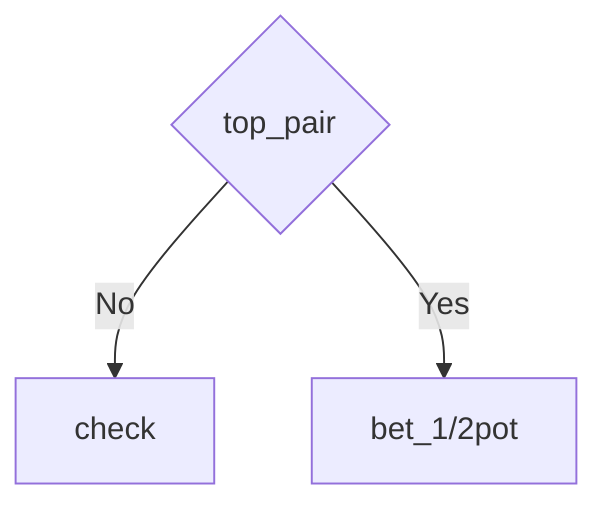

# Bucket Analysis and Decision Trees

## Overview

This module builds bucket matrices and decision trees from GTO range CSV files, enabling human-readable strategic analysis of PLO4 poker hands.

## Completed Tasks

✅ Copied bucketing logic from `omaha range predictor` project
✅ Built 2 bucket matrices for board **9s6d5c**
✅ Created 6 decision trees with `min_leaf` parameter (1, 10, 50)
✅ Exported all trees to Mermaid format with **readable bucket names**

## Project Structure

```
├── lib/
│   ├── buckets.py          # 85 functions analyzing poker hands
│   ├── card.py             # Card, CardValue, CardSuit classes
│   ├── data_loader.py      # GTO tree loader
│   └── query_agent.py      # AI agent for RAG
├── output/
│   ├── bucket_matrix_lead_9s6d5c.csv       # Matrix 1: Lead situation
│   ├── bucket_matrix_nolead_9s6d5c.csv     # Matrix 2: NoLead situation
│   ├── tree_lead_9s6d5c_min1.mmd           # Lead tree (detailed)
│   ├── tree_lead_9s6d5c_min10.mmd          # Lead tree (medium detail)
│   ├── tree_lead_9s6d5c_min50.mmd          # Lead tree (simplified)
│   ├── tree_nolead_9s6d5c_min1.mmd         # NoLead tree (detailed)
│   ├── tree_nolead_9s6d5c_min10.mmd        # NoLead tree (medium detail)
│   └── tree_nolead_9s6d5c_min50.mmd        # NoLead tree (simplified)
└── build_bucket_matrix.py  # Main script
```

## Matrix Descriptions

### Matrix 1: Lead (Initiative)
**Data sources:**
- `1_2 POT.csv` - 66,550 combos (bet 1/2 pot)
- `CHECK.csv` - 62,788 combos (check)

**Actions:** `bet_1/2pot`, `check`

### Matrix 2: NoLead (No Initiative)
**Data sources:**
- `NoLead_1_2 POT.csv` - 49,746 combos (bet 1/2 pot)
- `NoLead_CHECK.csv` - 79,510 combos (check)

**Actions:** `bet_1/2pot`, `check`

## Bucket Features (85 total)

Each combo is analyzed through 85 binary features with **readable names**:

### Made Hands
- `flush_royal`, `flush`, `nut_flush`, `nut_flush2`, `not_nut_flush`
- `set`, `top_set`, `middle_set`, `bottom_set`, `two_sets`
- `trips`, `quads`
- `full_house`, `full_house_nut`, `full_house_not_nut`
- `pair`, `top_pair`, `middle_pair`, `bottom_pair`
- `two_pairs`, `top_two_pairs`, `top_and_bottom_pairs`, `bottom_two_pairs`
- `three_pairs`, `over_pair`, `two_over_pairs`, `pocket_pair`
- `straight_flush`, `straight_nut`, `straight_nut2`, `straight_nut3`, `straight`

### Draws
- `flush_draw`, `not_nut_flush_draw`, `nut_flush_draw`, `nut_flush_draw2`
- `bdfd` (backdoor flush draw), `bdfd1`, `bdfd2`, `bdfd_nut`
- `straight_draw`, `backdoor_straight_draw`, `backdoor_straight_draw4`
- `gutshot`, `oesd` (open-ended straight draw)
- `wrap`, `wrap9`, `wrap12`, `wrap13`, `wrap16`, `wrap17`, `wrap20`
- `minor_wrap`, `major_wrap`
- `no_draw`

### Blockers
- `flush_blocker`, `flush_blocker_nut`, `flush_blocker_nut2`
- `flush_draw_blocker`, `flush_draw_blocker_nut`, `flush_draw_blocker1`, `flush_draw_blocker2`, `flush_draw_blocker_nut2`
- `straight_blocker`, `straight_blocker1-4`
- `straight_blocker_nut`, `straight_blocker_nut1-4`
- `straight_draw_blocker`, `straight_draw_blocker1-4`
- `straight_draw_blocker_nut`, `straight_draw_blocker_nut1-4`

### Preflop Features
- `tp_tk` (top pair top kicker)

## Decision Trees

For each matrix, 3 trees built with different detail levels:

### min_leaf = 1 (Maximum Detail)
- **Lead:** 34 KB, ~250+ nodes
- **NoLead:** 37 KB, ~270+ nodes
- Accuracy: 100% on training set
- Usage: Detailed analysis of all nuances

### min_leaf = 10 (Medium Detail)
- **Lead:** 12 KB, ~90 nodes
- **NoLead:** 12 KB, ~90 nodes
- Balance between accuracy and simplicity
- Usage: Practical play

### min_leaf = 50 (Simplified)
- **Lead:** 2.3 KB, ~20 nodes
- **NoLead:** 2.6 KB, ~22 nodes
- Maximum readability
- Usage: Quick decisions, learning

## Reading Mermaid Diagrams

### Example Node
```mermaid
flowchart TD
    node0{"straight_blocker"}  --> Check if straight blocker
    node0 -->|No| node1        --> If No straight blocker
    node0 -->|Yes| node2       --> If Yes has straight blocker
    node3["check"]             --> Leaf node: recommend CHECK
    node4["bet_1/2pot"]        --> Leaf node: recommend BET
```

### Viewing Options

#### Option 1: GitHub/GitLab
Insert `.mmd` file content in markdown:

\`\`\`markdown
\`\`\`mermaid
flowchart TD
    node0{"straight_blocker"}
    node0 -->|No| node1
    ...
\`\`\`
\`\`\`

#### Option 2: Online Viewer
1. Open https://mermaid.live
2. Paste `.mmd` file content
3. Export to PNG/SVG/PDF

#### Option 3: VS Code
Install "Markdown Preview Mermaid Support" extension

## Running the Script

```bash
# Install dependencies
pip install pandas scikit-learn tqdm

# Build matrices and trees
python3 build_bucket_matrix.py
```

The script automatically:
1. Loads CSV files with ranges
2. Buckets each combo (85 features)
3. Builds aggregated matrices
4. Trains decision trees
5. Exports to Mermaid format

## Configuration Parameters

In `build_bucket_matrix.py`:

```python
# Board
board = '9s6d5c'  # Any flop board

# Data sources
range_files = {
    'bet_1/2pot': 'path/to/file.csv',
    'check': 'path/to/file.csv'
}

# min_leaf parameter for trees
for min_leaf in [1, 10, 50]:  # Add other values
    ...
```

## Bucket Names Mapping

All 85 buckets are defined in `BUCKET_NAMES` list in `build_bucket_matrix.py`. The order matches the output of `get_all_buckets()` function in `lib/buckets.py`.

### Example Tree Node Interpretation



**Interpretation:** If you have `top_pair` = Yes, the GTO strategy recommends betting 1/2 pot. If No top pair, check.

## Performance

Processing on board 9s6d5c:
- **Lead matrix:** 129,338 combos → processed in ~3 minutes
- **NoLead matrix:** 129,256 combos → processed in ~3 minutes
- **Total time:** ~6 minutes

## Next Steps

1. **Tree Analysis:** Study which features are most important for decisions
2. **Lead vs NoLead Comparison:** Find key strategic differences
3. **Different Boards:** Build matrices for various flop textures
4. **RAG Integration:** Use trees to explain GTO decisions

## Technical Details

### Bucketing
- Function: `get_all_buckets(combo, board)`
- Input: `combo="AsKsQsTs"`, `board="9s6d5c"`
- Output: array of 85 binary features `[0, 1, 0, ..., 1]`

### Aggregation
- Group by unique feature combinations
- Sum weights (frequencies) by actions
- Normalize to percentages

### Decision Tree
- Algorithm: sklearn DecisionTreeClassifier
- Criterion: Gini impurity
- Parameter: `min_samples_leaf` (minimum samples in leaf)
- Weights: combo frequencies from GTO solver

---

**Date:** 2025-12-04
**Project:** LLM Range Tool - RAG system for PLO4/PLO5 GTO solutions
